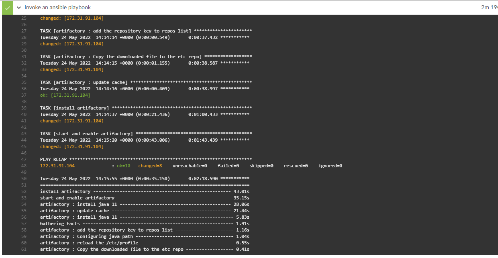
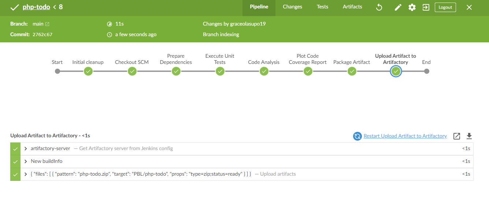

# Documentation of project 14

1. I logged into my jenkins console and installed "blue ocean"
   
   
   

2. I opened the blue ocean and created a pipeline
   
   
   
   
   

3. I created a new directory and named it 'deploy'

4. Then I created a jenkins file in the deploy directory
   
   

5. I inserted some commands in the jenkins file

   

6. I pushed it to my github account
    
    

7. I configured my ansible project on jenkins console
    
    
    
    

8. I clicked on build and went to check my pipeline
    

9. I created switched to a new branch called "feature/jenkins-pipeline-stages"
    
    
    

10. I added another stage to my jenkins file, pushed it and scanned the repository

    
    
    

11. I created a pull request

    

12. I added new stages to my jenkins file, pushed it and scanned it.

    
    
    
    
    
    

13. I installed ansible
   
   
   

14. I installed postgresql community

    

15. I installed the required dependencies

    
    
    
    

16. I installed ansible on my jenkins console
    
    
    

17. I add my private key to the global credentials on jenkins console

    

18. I configured my pipeline syntax and got my parameters
    
    

19. I ran my ansible command and it worked fine
    
    
    
    
    
    
    
    
    
    
    
    
    
    

20. In my ansible execution section, I removed "inventory/dev" and replaced it with  "${inventory}" so I will be able to pick any file in inventory on the pipeline

     
     
     

21. I forked a repository that was given
   
    `https://github.com/darey-devops/php-todo.git`
     
     

22. Then I cloned the repository "php-todo"
   
    

23. I installed php and it's dependencies

    
    
    
    

24. I installed 'plot' on jenkins console
    
    
    

25. I installed 'artifactory' also on jenkins console

    
     

26. I configured it and ran my playbook

    
    
    
    
    

28. I logged int my instance to confirm if mysql has been installed
    
    
    

29. I created another jenkins file in my php-todo directory, added some stages and ran the code
  
     
     
     
     

30. Plots was succesfully installed in my php branch on jenkins console
    
    

31. I uploaded artifactory successfully
    
    
    

32. I created another stage to deploy to dev environment
    
    

33. I exported the ansible.cfg file
    
    

34. Then I ran the playbook again and it worked

    
    
    
    
    

35. I checked my sonarqube server
    
    

36. I installed sonarqube scanner on jenkins console and configured it
    
    
    

37. I created a webhook on my sonarqube server
    
    
    

38. I created a step but it failed because I didn't update scanner properties

     

39. I updated the scanner properties then I ran it successfully
    
    

40. I introduced jenkins agent
    
    

41. I configured webhook between jenkins and github to automatically run the pipeline when there is a push
    
    